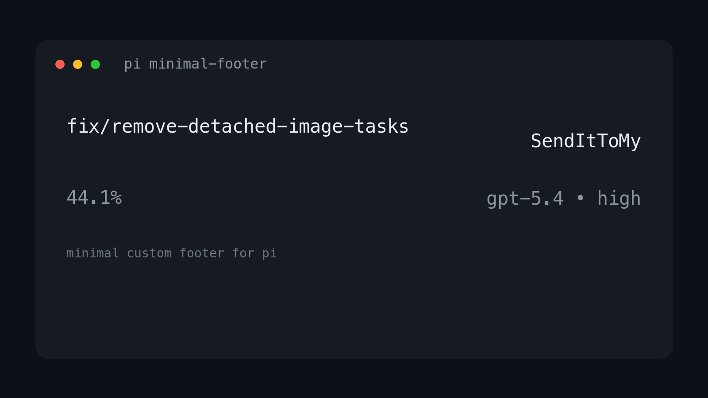

# minimal-footer

A minimal custom footer for pi.



It replaces pi's built-in footer with a cleaner two-line layout that focuses on the information I care about most:

- current git branch
- current repo name
- current context percentage
- current model and thinking level

## Layout

On wide terminals it renders two lines:

```text
<git-branch>                                         <repo-name>
<context-%>                                     <model> • <thinking>
```

Example:

```text
fix/remove-detached-image-tasks                     SendItToMy
44.1%                                              gpt-5.4 • high
```

On narrow terminals it falls back to one item per line.

## Install

Install the repo:

```bash
pi install git:github.com/diegopetrucci/pi-extensions
```

Or pin to the latest tagged version:

```bash
pi install git:github.com/diegopetrucci/pi-extensions@v0.1.1
```

Then reload pi:

```text
/reload
```

## What it shows

- **Top left:** current git branch
- **Top right:** current repo directory name
- **Bottom left:** current context usage percentage
- **Bottom right:** model id and thinking level

## Notes

- Replaces pi's built-in footer entirely.
- Uses pi footer data for git branch updates.
- Shows only context percentage, not context window size.
- Shows the model id rather than a provider-specific display label.
